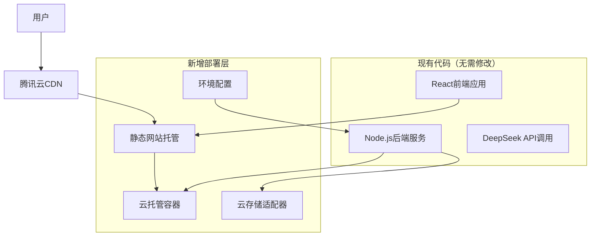
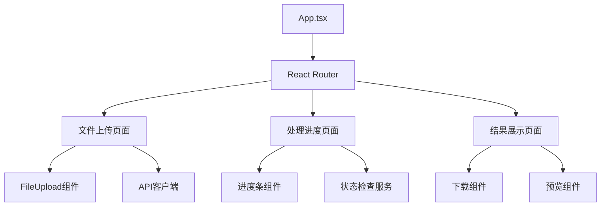
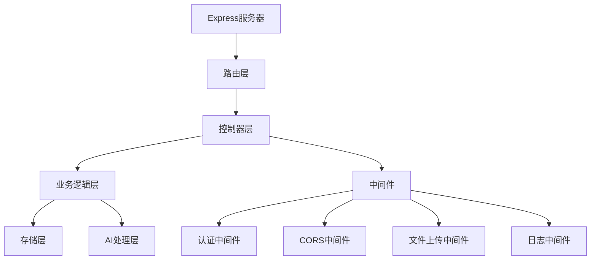

# CloudBase部署设计文档

## 概述

本设计文档描述了如何以最小代码修改的方式将现有的智能语言学习助手部署到腾讯云CloudBase平台。设计原则是保持现有代码结构不变，仅添加必要的部署配置和环境适配代码。

**最小修改原则：**
- 保持现有前后端代码结构不变
- 仅添加CloudBase部署配置文件
- 最小化环境变量和配置调整
- 复用现有的文件上传和AI处理逻辑

核心技术栈：
- 前端：React + Vite + TypeScript（保持不变）
- 后端：Node.js + Express + TypeScript（保持不变）
- 云平台：腾讯云CloudBase（新增部署层）
- AI服务：DeepSeek API（保持不变）
- 存储：CloudBase云存储（替换本地存储）
- CDN：腾讯云CDN（自动启用）

## 架构设计

### 最小修改部署策略



### 代码修改最小化策略

1. **前端零修改部署**
   - 直接使用现有的`npm run build`构建产物
   - 通过环境变量配置API端点
   - 无需修改任何React组件代码

2. **后端最小修改**
   - 保持现有Express路由和业务逻辑不变
   - 仅添加CloudBase存储适配器
   - 通过环境变量切换存储方式

3. **配置文件新增**
   - 添加`cloudbaserc.json`部署配置
   - 添加`Dockerfile`容器化配置
   - 添加环境变量配置文件

### 文件修改清单

**需要新增的文件：**
- `cloudbaserc.json` - CloudBase部署配置
- `Dockerfile` - 后端容器化配置
- `.env.production` - 生产环境变量
- `src/utils/storage-adapter.ts` - 存储适配器（后端）

**需要微调的文件：**
- `vite.config.ts` - 添加环境变量配置
- `package.json` - 添加部署脚本
- 后端存储相关文件 - 使用适配器模式

## 组件和接口设计

### 前端组件架构



#### 前端最小修改方案

**无需修改现有组件代码**，仅需要：

1. **环境变量配置（新增）**
   ```typescript
   // vite.config.ts - 仅添加环境变量配置
   export default defineConfig({
     // 现有配置保持不变
     define: {
       __API_BASE_URL__: JSON.stringify(process.env.VITE_API_BASE_URL || '/api')
     }
   });
   ```

2. **生产环境变量文件（新增）**
   ```bash
   # .env.production
   VITE_API_BASE_URL=https://your-service.service.tcloudbase.com/api
   ```

3. **构建脚本调整（package.json微调）**
   ```json
   {
     "scripts": {
       "build:prod": "vite build --mode production",
       "deploy": "cloudbase framework deploy"
     }
   }
   ```

**现有的React组件、路由、状态管理等代码完全不需要修改**

### 后端服务架构



### 后端最小修改方案

**保持现有业务逻辑不变**，仅需要：

1. **存储适配器（新增文件）**
   ```typescript
   // src/utils/storage-adapter.ts
   interface StorageAdapter {
     uploadFile(file: Buffer, filename: string): Promise<string>;
     downloadFile(fileId: string): Promise<Buffer>;
     deleteFile(fileId: string): Promise<void>;
   }
   
   class CloudBaseStorageAdapter implements StorageAdapter {
     // CloudBase存储实现
   }
   
   class LocalStorageAdapter implements StorageAdapter {
     // 本地存储实现（开发环境）
   }
   
   export const storageAdapter = process.env.NODE_ENV === 'production' 
     ? new CloudBaseStorageAdapter() 
     : new LocalStorageAdapter();
   ```

2. **现有控制器微调**
   ```typescript
   // 现有的FileController只需要替换存储调用
   import { storageAdapter } from '../utils/storage-adapter';
   
   class FileController {
     async uploadFile(req: Request, res: Response): Promise<void> {
       // 现有逻辑保持不变
       const fileUrl = await storageAdapter.uploadFile(fileBuffer, filename);
       // 其余代码不变
     }
   }
   ```

3. **环境变量配置（新增）**
   ```bash
   # 添加到现有的环境变量文件
   CLOUDBASE_ENV_ID=your-env-id
   CLOUDBASE_SECRET_ID=your-secret-id
   CLOUDBASE_SECRET_KEY=your-secret-key
   ```

**现有的Express路由、中间件、AI处理逻辑等完全不需要修改**

### API接口设计

#### RESTful API端点

1. **文件上传接口**
   ```
   POST /api/files/upload
   Content-Type: multipart/form-data
   
   Request:
   - file: File (max 5MB, .txt/.srt)
   
   Response:
   {
     "taskId": "uuid",
     "status": "uploaded",
     "message": "文件上传成功"
   }
   ```

2. **处理状态查询**
   ```
   GET /api/tasks/{taskId}/status
   
   Response:
   {
     "taskId": "uuid",
     "status": "processing|completed|failed",
     "progress": 75,
     "message": "处理中...",
     "estimatedTime": 120
   }
   ```

3. **结果下载接口**
   ```
   GET /api/tasks/{taskId}/result
   
   Response:
   Content-Type: text/html
   Content-Disposition: attachment; filename="learning-material.html"
   
   [HTML学习材料内容]
   ```

4. **健康检查接口**
   ```
   GET /api/health
   
   Response:
   {
     "status": "healthy",
     "timestamp": "2024-01-01T00:00:00Z",
     "services": {
       "database": "healthy",
       "storage": "healthy",
       "ai": "healthy"
     }
   }
   ```

## 数据模型设计

### 任务状态模型

```typescript
interface ProcessingTask {
  taskId: string;
  status: 'uploaded' | 'processing' | 'completed' | 'failed';
  originalFileName: string;
  fileSize: number;
  uploadTime: Date;
  startTime?: Date;
  completedTime?: Date;
  progress: number;
  errorMessage?: string;
  resultFileId?: string;
  cleanupScheduled: Date;
}
```

### 文件元数据模型

```typescript
interface FileMetadata {
  fileId: string;
  originalName: string;
  size: number;
  mimeType: string;
  uploadTime: Date;
  storageUrl: string;
  isTemporary: boolean;
  expiresAt?: Date;
}
```

### 配置模型

```typescript
interface DeploymentConfig {
  environment: 'development' | 'staging' | 'production';
  apiConfig: {
    deepSeekApiKey: string;
    deepSeekBaseUrl: string;
    maxRequestTimeout: number;
  };
  storageConfig: {
    bucketName: string;
    maxFileSize: number;
    allowedTypes: string[];
    cleanupInterval: number;
  };
  serverConfig: {
    port: number;
    corsOrigins: string[];
    maxInstances: number;
    autoScaleThreshold: number;
  };
}
```

## 错误处理设计

### 错误分类和处理策略

1. **客户端错误 (4xx)**
   ```typescript
   class ClientError extends Error {
     constructor(
       public code: string,
       public message: string,
       public statusCode: number = 400
     ) {
       super(message);
     }
   }
   
   // 使用示例
   throw new ClientError('FILE_TOO_LARGE', '文件大小超过5MB限制', 413);
   throw new ClientError('INVALID_FILE_TYPE', '不支持的文件格式', 415);
   ```

2. **服务器错误 (5xx)**
   ```typescript
   class ServerError extends Error {
     constructor(
       public code: string,
       public message: string,
       public statusCode: number = 500,
       public originalError?: Error
     ) {
       super(message);
     }
   }
   
   // 使用示例
   throw new ServerError('AI_SERVICE_UNAVAILABLE', 'AI服务暂时不可用', 503);
   throw new ServerError('STORAGE_ERROR', '文件存储失败', 500, originalError);
   ```

3. **错误处理中间件**
   ```typescript
   const errorHandler = (err: Error, req: Request, res: Response, next: NextFunction) => {
     logger.error('API Error:', {
       error: err.message,
       stack: err.stack,
       url: req.url,
       method: req.method,
       timestamp: new Date().toISOString()
     });
     
     if (err instanceof ClientError) {
       return res.status(err.statusCode).json({
         error: err.code,
         message: err.message
       });
     }
     
     if (err instanceof ServerError) {
       return res.status(err.statusCode).json({
         error: err.code,
         message: err.message
       });
     }
     
     // 未知错误
     res.status(500).json({
       error: 'INTERNAL_SERVER_ERROR',
       message: '服务器内部错误'
     });
   };
   ```

### 重试机制设计

```typescript
class RetryService {
  async executeWithRetry<T>(
    operation: () => Promise<T>,
    maxRetries: number = 3,
    backoffMs: number = 1000
  ): Promise<T> {
    let lastError: Error;
    
    for (let attempt = 1; attempt <= maxRetries; attempt++) {
      try {
        return await operation();
      } catch (error) {
        lastError = error as Error;
        
        if (attempt === maxRetries) {
          throw lastError;
        }
        
        // 指数退避
        const delay = backoffMs * Math.pow(2, attempt - 1);
        await new Promise(resolve => setTimeout(resolve, delay));
      }
    }
    
    throw lastError!;
  }
}
```

## 测试策略

### 测试金字塔

1. **单元测试 (70%)**
   - 业务逻辑函数测试
   - 工具函数测试
   - 组件单元测试

2. **集成测试 (20%)**
   - API接口测试
   - 数据库集成测试
   - 外部服务集成测试

3. **端到端测试 (10%)**
   - 完整用户流程测试
   - 跨浏览器兼容性测试

### 测试环境配置

```typescript
// 测试配置
const testConfig = {
  api: {
    baseUrl: 'http://localhost:3000',
    timeout: 5000
  },
  storage: {
    mockStorage: true,
    testBucket: 'test-bucket'
  },
  ai: {
    mockAI: true,
    testApiKey: 'test-key'
  }
};

// 测试工具
class TestUtils {
  static createMockFile(name: string, size: number): File;
  static mockAIResponse(content: string): Promise<string>;
  static cleanupTestFiles(): Promise<void>;
}
```

### 性能测试

```typescript
// 负载测试配置
const loadTestConfig = {
  concurrent: 100,
  duration: '5m',
  scenarios: {
    fileUpload: {
      weight: 40,
      endpoint: '/api/files/upload'
    },
    statusCheck: {
      weight: 50,
      endpoint: '/api/tasks/{id}/status'
    },
    download: {
      weight: 10,
      endpoint: '/api/tasks/{id}/result'
    }
  }
};
```

## 部署配置

### CloudBase配置文件

```json
{
  "envId": "your-env-id",
  "framework": {
    "name": "language-learning-assistant",
    "plugins": {
      "client": {
        "use": "@cloudbase/framework-plugin-website",
        "inputs": {
          "buildCommand": "npm run build",
          "outputPath": "dist",
          "cloudPath": "/",
          "ignore": [".git", ".github", "node_modules"]
        }
      },
      "server": {
        "use": "@cloudbase/framework-plugin-container",
        "inputs": {
          "serviceName": "language-learning-api",
          "servicePath": "/api",
          "dockerfilePath": "./Dockerfile",
          "buildDir": "./",
          "cpu": 1,
          "mem": 2,
          "minNum": 1,
          "maxNum": 10,
          "policyType": "cpu",
          "policyThreshold": 70,
          "envVariables": {
            "NODE_ENV": "production"
          }
        }
      }
    }
  }
}
```

### Docker配置

```dockerfile
# 多阶段构建
FROM node:18-alpine AS builder

WORKDIR /app
COPY package*.json ./
RUN npm ci --only=production

FROM node:18-alpine AS runtime

WORKDIR /app
COPY --from=builder /app/node_modules ./node_modules
COPY . .

EXPOSE 3000

# 健康检查
HEALTHCHECK --interval=30s --timeout=3s --start-period=5s --retries=3 \
  CMD curl -f http://localhost:3000/api/health || exit 1

CMD ["npm", "start"]
```

### 环境变量配置

```bash
# 生产环境变量
NODE_ENV=production
PORT=3000

# DeepSeek API配置
DEEPSEEK_API_KEY=${env.DEEPSEEK_API_KEY}
DEEPSEEK_BASE_URL=https://api.deepseek.com

# CloudBase配置
CLOUDBASE_ENV_ID=${env.CLOUDBASE_ENV_ID}
CLOUDBASE_SECRET_ID=${env.CLOUDBASE_SECRET_ID}
CLOUDBASE_SECRET_KEY=${env.CLOUDBASE_SECRET_KEY}

# 存储配置
STORAGE_BUCKET=language-learning-files
MAX_FILE_SIZE=5242880
CLEANUP_INTERVAL_HOURS=24

# CORS配置
CORS_ORIGINS=https://your-domain.com,https://your-domain.tcloudbaseapp.com

# 日志配置
LOG_LEVEL=info
LOG_FORMAT=json
```

### 监控和告警配置

```yaml
# 监控配置
monitoring:
  metrics:
    - name: "api_response_time"
      type: "histogram"
      description: "API响应时间"
    - name: "file_upload_count"
      type: "counter"
      description: "文件上传次数"
    - name: "ai_processing_duration"
      type: "histogram"
      description: "AI处理耗时"
  
  alerts:
    - name: "high_response_time"
      condition: "api_response_time > 5s"
      action: "send_notification"
    - name: "high_error_rate"
      condition: "error_rate > 5%"
      action: "auto_scale"
    - name: "storage_quota_exceeded"
      condition: "storage_usage > 80%"
      action: "cleanup_old_files"
```

## 安全设计

### 安全措施

1. **输入验证**
   ```typescript
   const fileValidation = {
     maxSize: 5 * 1024 * 1024, // 5MB
     allowedTypes: ['.txt', '.srt'],
     allowedMimeTypes: ['text/plain', 'application/x-subrip'],
     
     validate(file: File): ValidationResult {
       if (file.size > this.maxSize) {
         return { valid: false, error: 'FILE_TOO_LARGE' };
       }
       
       const extension = path.extname(file.name).toLowerCase();
       if (!this.allowedTypes.includes(extension)) {
         return { valid: false, error: 'INVALID_FILE_TYPE' };
       }
       
       return { valid: true };
     }
   };
   ```

2. **CORS配置**
   ```typescript
   const corsOptions = {
     origin: (origin: string, callback: Function) => {
       const allowedOrigins = process.env.CORS_ORIGINS?.split(',') || [];
       
       if (!origin || allowedOrigins.includes(origin)) {
         callback(null, true);
       } else {
         callback(new Error('Not allowed by CORS'));
       }
     },
     credentials: true,
     methods: ['GET', 'POST', 'PUT', 'DELETE'],
     allowedHeaders: ['Content-Type', 'Authorization']
   };
   ```

3. **请求限制**
   ```typescript
   const rateLimiter = rateLimit({
     windowMs: 15 * 60 * 1000, // 15分钟
     max: 100, // 最多100个请求
     message: '请求过于频繁，请稍后再试',
     standardHeaders: true,
     legacyHeaders: false
   });
   ```

### 数据保护

```typescript
class DataProtection {
  // 敏感数据脱敏
  static sanitizeLog(data: any): any {
    const sensitiveFields = ['apiKey', 'password', 'token'];
    const sanitized = { ...data };
    
    sensitiveFields.forEach(field => {
      if (sanitized[field]) {
        sanitized[field] = '***';
      }
    });
    
    return sanitized;
  }
  
  // 文件内容安全检查
  static async scanFileContent(content: string): Promise<boolean> {
    const maliciousPatterns = [
      /<script\b[^<]*(?:(?!<\/script>)<[^<]*)*<\/script>/gi,
      /javascript:/gi,
      /on\w+\s*=/gi
    ];
    
    return !maliciousPatterns.some(pattern => pattern.test(content));
  }
}
```

这个设计文档涵盖了CloudBase部署的完整架构，包括前后端分离部署、容器化、安全性、监控和自动化等各个方面。设计充分考虑了需求文档中的所有要求，并提供了具体的技术实现方案。
## 最小
修改部署步骤

### 步骤1：添加部署配置文件

1. **创建CloudBase配置文件**
   ```json
   // cloudbaserc.json
   {
     "envId": "your-env-id",
     "framework": {
       "name": "language-learning-assistant",
       "plugins": {
         "client": {
           "use": "@cloudbase/framework-plugin-website",
           "inputs": {
             "buildCommand": "npm run build:prod",
             "outputPath": "dist"
           }
         },
         "server": {
           "use": "@cloudbase/framework-plugin-container",
           "inputs": {
             "serviceName": "api",
             "servicePath": "/api",
             "dockerfilePath": "./Dockerfile"
           }
         }
       }
     }
   }
   ```

2. **创建Dockerfile**
   ```dockerfile
   FROM node:18-alpine
   WORKDIR /app
   COPY package*.json ./
   RUN npm ci --only=production
   COPY . .
   EXPOSE 3000
   CMD ["npm", "start"]
   ```

### 步骤2：环境变量配置

1. **前端环境变量**
   ```bash
   # .env.production
   VITE_API_BASE_URL=https://your-service.service.tcloudbase.com/api
   ```

2. **后端环境变量（CloudBase控制台配置）**
   ```bash
   NODE_ENV=production
   DEEPSEEK_API_KEY=your-deepseek-key
   CLOUDBASE_ENV_ID=your-env-id
   ```

### 步骤3：存储适配器实现

```typescript
// src/utils/storage-adapter.ts
import { CloudBase } from '@cloudbase/node-sdk';

class CloudBaseStorageAdapter implements StorageAdapter {
  private app: CloudBase.App;
  
  constructor() {
    this.app = CloudBase.init({
      env: process.env.CLOUDBASE_ENV_ID!
    });
  }
  
  async uploadFile(file: Buffer, filename: string): Promise<string> {
    const result = await this.app.uploadFile({
      cloudPath: `uploads/${filename}`,
      fileContent: file
    });
    return result.fileID;
  }
  
  async downloadFile(fileId: string): Promise<Buffer> {
    const result = await this.app.downloadFile({ fileID: fileId });
    return result.fileContent;
  }
  
  async deleteFile(fileId: string): Promise<void> {
    await this.app.deleteFile({ fileList: [fileId] });
  }
}
```

### 步骤4：部署脚本

```json
// package.json 添加脚本
{
  "scripts": {
    "build:prod": "vite build --mode production",
    "deploy": "cloudbase framework deploy",
    "deploy:init": "cloudbase login && cloudbase init"
  }
}
```

### 部署命令

```bash
# 1. 安装CloudBase CLI
npm install -g @cloudbase/cli

# 2. 登录CloudBase
cloudbase login

# 3. 初始化项目（首次）
cloudbase init

# 4. 部署应用
npm run deploy
```

## 代码修改影响分析

### 前端修改影响
- **修改文件数量：** 2个文件（vite.config.ts, .env.production）
- **代码行数变化：** +10行
- **现有功能影响：** 无影响，完全向后兼容

### 后端修改影响
- **修改文件数量：** 3个文件（storage-adapter.ts, 环境变量, 存储调用处）
- **代码行数变化：** +50行
- **现有功能影响：** 无影响，通过适配器模式保持兼容

### 总体修改评估
- **新增配置文件：** 4个（cloudbaserc.json, Dockerfile, .env.production, storage-adapter.ts）
- **修改现有文件：** 最多3个文件的微调
- **代码变更风险：** 极低，主要是配置和适配器添加
- **回滚难度：** 简单，删除新增文件即可恢复原状

这种最小修改方案确保了现有代码的稳定性，同时实现了CloudBase平台的完整部署能力。