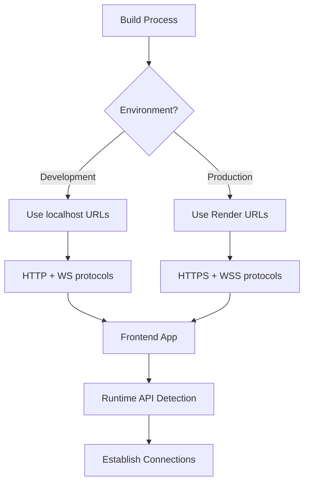

# Design Document

## Overview

This design addresses the deployment configuration issues that prevent the frontend from connecting to the backend on Render. The solution implements environment-aware configuration management that automatically adapts to development and production environments without requiring code changes.

The core issue is that the frontend currently has hardcoded localhost URLs for both HTTP API calls and WebSocket connections, which work in development but fail in production where services run on different domains.

## Architecture

### Environment Configuration Strategy

The solution uses a multi-layered configuration approach:

1. **Frontend Environment Variables**: Vite's built-in environment variable system
2. **Backend CORS Configuration**: Dynamic origin allowlist based on environment
3. **Protocol Detection**: Automatic HTTP/HTTPS and WS/WSS protocol selection
4. **Fallback Mechanisms**: Graceful degradation when connections fail

### Configuration Flow



## Components and Interfaces

### 1. Frontend Configuration Module

**Location**: `frontend/src/config/api.js`

**Purpose**: Centralized API endpoint configuration with environment detection

**Interface**:
```javascript
export const API_CONFIG = {
  baseURL: string,
  wsURL: string,
  timeout: number,
  retries: number
}

export const getApiUrl = (endpoint: string) => string
export const getWebSocketUrl = () => string
```

### 2. Environment Variable Configuration

**Frontend Variables** (`.env` files):
- `VITE_API_URL`: Backend API base URL
- `VITE_WS_URL`: WebSocket server URL (optional, derived from API_URL if not set)
- `VITE_APP_ENV`: Environment identifier

**Backend Variables** (existing):
- `NODE_ENV`: Environment mode
- `PORT`: Server port
- `HOST`: Server host binding

### 3. Enhanced CORS Configuration

**Location**: `backend/src/config/index.js`

**Enhancement**: Dynamic origin configuration based on environment

**Interface**:
```javascript
cors: {
  origins: string[],
  credentials: boolean,
  methods: string[],
  allowedHeaders: string[]
}
```

### 4. WebSocket Connection Manager

**Location**: `frontend/src/services/websocket.js`

**Purpose**: Robust WebSocket connection with environment-aware URL resolution

**Interface**:
```javascript
class WebSocketManager {
  connect(): Promise<WebSocket>
  disconnect(): void
  reconnect(): Promise<WebSocket>
  onMessage(callback: Function): void
  onError(callback: Function): void
}
```

## Data Models

### Configuration Schema

```typescript
interface ApiConfiguration {
  baseURL: string;
  wsURL: string;
  timeout: number;
  retries: number;
  environment: 'development' | 'production';
}

interface CorsConfiguration {
  origins: string[];
  credentials: boolean;
  methods: string[];
  allowedHeaders: string[];
}
```

### Environment Detection

```typescript
interface EnvironmentConfig {
  isDevelopment: boolean;
  isProduction: boolean;
  apiUrl: string;
  wsUrl: string;
  protocol: 'http' | 'https';
  wsProtocol: 'ws' | 'wss';
}
```

## Error Handling

### Connection Failure Scenarios

1. **Backend Unreachable**: Display user-friendly error with retry option
2. **WebSocket Connection Failed**: Fall back to polling mechanism
3. **CORS Blocked**: Log detailed error for debugging
4. **Invalid Environment Config**: Use sensible defaults with warnings

### Error Recovery Strategies

1. **Exponential Backoff**: For WebSocket reconnection attempts
2. **Circuit Breaker**: Prevent excessive retry attempts
3. **Graceful Degradation**: Disable real-time features if WebSocket fails
4. **User Notification**: Clear error messages with suggested actions

### Error Logging

```javascript
// Frontend error tracking
const logConnectionError = (error, context) => {
  console.error(`[Connection Error] ${context}:`, error);
  // Send to monitoring service in production
};

// Backend error handling
const handleCorsError = (origin, req) => {
  Logger.warn('CORS blocked request', { 
    origin, 
    path: req.path,
    method: req.method 
  });
};
```

## Testing Strategy

### Unit Tests

1. **Configuration Module**: Test environment variable parsing
2. **WebSocket Manager**: Test connection, reconnection, and error handling
3. **CORS Configuration**: Test origin validation logic

### Integration Tests

1. **API Connectivity**: Test HTTP requests in different environments
2. **WebSocket Communication**: Test real-time message exchange
3. **Error Scenarios**: Test connection failures and recovery

### End-to-End Tests

1. **Development Environment**: Full workflow with localhost
2. **Production Simulation**: Test with production-like URLs
3. **Cross-Origin Requests**: Verify CORS configuration works

### Manual Testing Checklist

1. **Local Development**: Verify localhost connections work
2. **Render Deployment**: Test production URLs
3. **Network Failures**: Test offline/online scenarios
4. **Browser Compatibility**: Test WebSocket support across browsers

## Implementation Considerations

### Vite Environment Variables

- Use `VITE_` prefix for client-side variables
- Configure different `.env` files for environments
- Implement runtime environment detection

### Render Deployment

- Configure environment variables in Render dashboard
- Use build-time variable substitution
- Ensure proper service naming and URL generation

### Security Considerations

- Validate all environment variables
- Implement proper CORS origin validation
- Use secure WebSocket (WSS) in production
- Sanitize error messages to prevent information leakage

### Performance Optimizations

- Cache configuration values
- Implement connection pooling for HTTP requests
- Use WebSocket heartbeat to maintain connections
- Minimize reconnection attempts with exponential backoff