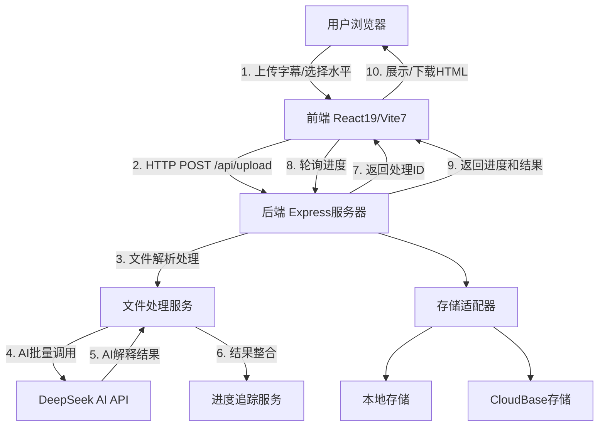

# 智能语言学习助手 - 项目架构与文件说明 (v2.0)

---

## 1. 项目定位与技术栈

- **定位**：通过上传英语字幕（TXT/SRT），利用AI（DeepSeek API）自动生成个性化学习材料，支持多种英语水平，采用现代化前后端分离架构，完全移除WebSocket依赖。
- **前端**：React 19.1.0 + Vite 7.0.4 + Ant Design 5.26.5 + Axios 1.10.0
- **后端**：Node.js 18+ + Express 4.18.2 + Winston 3.11.0 + CloudBase SDK 2.8.1
- **部署**：Docker容器化 + CloudBase云部署 + 多平台支持

---

## 2. 架构图（文字版）

> 采用现代化HTTP通信 + 轮询机制，完全移除WebSocket依赖，提升部署稳定性

---

## 3. 数据流程图（简化）

1. **文件上传** → 前端验证 + 拖拽支持
2. **后端接收** → Multer中间件处理 + 文件类型验证
3. **初始化处理** → 创建进度追踪 + 文件解析
4. **AI批量处理** → 智能分句 + 批量调用DeepSeek API
5. **进度追踪** → 实时更新处理进度和日志
6. **结果返回** → 生成HTML学习材料 + JSON数据
7. **前端轮询** → 定时查询处理进度和结果
8. **结果展示** → 交互式学习界面 + 下载功能

---

## 4. 主要功能模块说明

### 4.1 前端（frontend/）

- `src/App.jsx`：主应用组件，管理整个应用状态和用户界面。 // 核心组件
- `src/main.jsx`：React应用入口文件，渲染根组件。 // 启动入口
- `src/config/api.js`：API基础URL和环境配置管理。 // 配置中心
- `src/components/ErrorPage.jsx`：错误页面组件，处理应用异常。 // 错误处理
- `src/assets/`：静态资源目录（图片、图标等）。 // 资源文件
- `App.css/index.css`：应用样式文件，采用现代化设计。 // 视觉设计
- `vite.config.js`：Vite构建工具配置。 // 构建配置
- `eslint.config.js`：ESLint代码检查配置。 // 代码质量
- `package.json`：前端依赖和脚本配置。 // 项目配置
- `README.md`：前端开发说明文档。 // 开发文档

### 4.2 后端（backend/） - v2.0重构版

#### 核心启动文件
- `src/index.js`：服务器启动入口，初始化配置和环境。 // 应用启动
- `src/app.js`：Express应用主配置，集成中间件、路由、错误处理。 // 应用架构

#### 配置管理
- `src/config/index.js`：统一配置管理（服务器、CORS、AI、上传、存储等）。 // 配置中心

#### 控制器层
- `src/controllers/uploadController.js`：文件上传和处理主控制器。 // 请求处理

#### 服务层
- `src/services/aiService.js`：DeepSeek AI服务集成，智能分句和解释生成。 // AI核心服务
- `src/services/fileProcessingService.js`：文件解析处理，支持TXT/SRT格式。 // 文件处理服务
- `src/services/progressService.js`：进度追踪和日志管理服务。 // 进度管理

#### 适配器层
- `src/adapters/StorageAdapter.js`：存储适配器抽象基类。 // 存储抽象
- `src/adapters/LocalStorageAdapter.js`：本地文件系统存储适配器。 // 本地存储
- `src/adapters/CloudBaseStorageAdapter.js`：CloudBase云存储适配器。 // 云存储
- `src/adapters/StorageAdapterFactory.js`：存储适配器工厂模式。 // 适配器工厂

#### 路由层
- `src/routes/uploadRoutes.js`：RESTful API路由定义（上传、进度查询、健康检查）。 // API路由

#### 中间件层
- `src/middleware/upload.js`：Multer文件上传中间件和验证。 // 上传中间件

#### 工具层
- `src/utils/logger.js`：Winston结构化日志系统。 // 日志工具
- `src/utils/errorResponse.js`：统一错误响应格式化工具。 // 错误处理
- `src/utils/networkDiagnostic.js`：网络诊断和健康检查工具。 // 网络诊断

#### 其他文件
- `logs/`：日志文件存储目录。 // 日志存储
- `uploads/`：临时文件上传目录。 // 文件存储
- `package.json`：后端依赖和脚本（v2.0.0）。 // 项目配置
- `README.md`：后端开发说明文档。 // 开发文档
- `LARGE_FILE_OPTIMIZATION.md`：大文件处理优化文档。 // 技术文档

---

## 5. 文件作用一览表

| 文件/目录 | 作用 | 是否影响系统功能 | 版本更新 |
|---|---|---|---|
| **前端文件** |
| frontend/src/App.jsx | 主应用组件 | 是 | 更新为React19 |
| frontend/src/main.jsx | 应用入口 | 是 | React19入口 |
| frontend/src/config/api.js | API配置管理 | 是 | 移除WebSocket配置 |
| frontend/src/components/ErrorPage.jsx | 错误页面组件 | 是 | 新增组件 |
| frontend/src/assets/ | 静态资源 | 否（仅影响外观）| 新增目录 |
| frontend/App.css, index.css | 样式文件 | 否（仅影响外观）| 现代化设计 |
| frontend/vite.config.js | Vite构建配置 | 否（开发）| 升级到Vite7 |
| frontend/eslint.config.js | 代码检查配置 | 否（开发）| ESLint9配置 |
| **后端文件 (v2.0重构)** |
| backend/src/index.js | 服务器启动入口 | 是 | 重构优化 |
| backend/src/app.js | Express应用配置 | 是 | 重构优化 |
| backend/src/config/index.js | 统一配置管理 | 是 | 新增存储配置 |
| backend/src/controllers/uploadController.js | 上传控制器 | 是 | 优化逻辑 |
| backend/src/services/aiService.js | AI服务核心 | 是 | 性能优化 |
| backend/src/services/fileProcessingService.js | 文件处理服务 | 是 | 增强稳定性 |
| backend/src/services/progressService.js | 进度追踪服务 | 是 | 新增服务 |
| backend/src/adapters/*.js | 存储适配器 | 是 | 新增架构 |
| backend/src/routes/uploadRoutes.js | API路由定义 | 是 | 增加新端点 |
| backend/src/middleware/upload.js | 上传中间件 | 是 | 优化验证 |
| backend/src/utils/logger.js | Winston日志系统 | 是 | 重构为Winston |
| backend/src/utils/errorResponse.js | 错误响应工具 | 是 | 新增工具 |
| backend/src/utils/networkDiagnostic.js | 网络诊断工具 | 是 | 功能增强 |
| **根目录文件** |
| package.json | 根项目配置 | 是 | 添加统一脚本 |
| Dockerfile | 容器化配置 | 否（部署）| 多阶段构建 |
| cloudbaserc.json | CloudBase配置 | 否（部署）| 保持兼容 |
| scripts/deploy.sh | 部署脚本 | 否（部署）| 新增脚本 |
| **文档文件** |
| README.md | 项目主文档 | 否（文档）| 更新内容 |
| 项目架构分析报告.md | 架构分析文档 | 否（文档）| 正在更新 |
| 项目架构与文件说明.md | 文件结构说明 | 否（文档）| 正在更新 |
| CloudBase部署方案.md | 云部署文档 | 否（文档）| 将更新 |
| **已删除文件** |
| ~~language-learning-functions/~~ | ~~CloudBase云函数~~ | ~~否~~ | 已完全移除 |

---

## 6. 系统文件分类说明

### 6.1 核心功能文件（不可删除）
- **前端**: `App.jsx`, `main.jsx`, `api.js`, `package.json`
- **后端**: `index.js`, `app.js`, `config/`, `controllers/`, `services/`, `adapters/`, `routes/`, `middleware/`
- **配置**: `.env`, `package.json`, `cloudbaserc.json`

### 6.2 开发辅助文件（影响开发体验）
- **构建工具**: `vite.config.js`, `eslint.config.js`, `Dockerfile`
- **脚本**: `scripts/deploy.sh`, `package.json`中的scripts
- **项目管理**: `.gitignore`, `package-lock.json`

### 6.3 样式和资源文件（仅影响外观）
- **样式**: `App.css`, `index.css`
- **资源**: `src/assets/` 目录下的所有文件
- **组件**: `ErrorPage.jsx`（错误处理显示）

### 6.4 文档文件（可删除，不影响功能）
- **项目文档**: `README.md`, `项目架构分析报告.md`, `项目架构与文件说明.md`
- **技术文档**: `LARGE_FILE_OPTIMIZATION.md`, `CloudBase部署方案.md`
- **子模块文档**: `frontend/README.md`, `backend/README.md`

### 6.5 临时和日志文件（运行时生成）
- **日志**: `backend/logs/` 目录下的所有文件
- **上传**: `backend/uploads/` 目录下的临时文件
- **构建**: `frontend/dist/` 目录（构建后生成）

### 6.6 已移除的旧架构
- ~~`language-learning-functions/`~~: CloudBase云函数目录，已移除
- ~~`websocket相关文件`~~: WebSocket功能已完全移除
- ~~`test_*.js`~~: 旧的测试文件，已清理

---

## 7. 主要挑战与限制

- **AI接口依赖**：DeepSeek API的可用性和费用控制影响使用体验，已实现智能重试和缓存优化。
- **大文件处理**：已实现分块处理、进度追踪和内存优化，但超大文件(>5MB)仍有处理限制。
- **HTTP通信限制**：采用轮询机制获取实时进度，相比WebSocket实时性略有延迟。
- **存储和部署**：支持多种存储后端和部署方式，但需要适当的环境配置。

---

## 8. 备注与建议

- **技术升级**: 项目已升级到React 19 + Vite 7，后端采用v2.0重构架构。
- **架构优化**: 完全移除WebSocket，采用HTTP + 轮询的稳定通信方式。
- **存储灵活性**: 新增适配器模式，支持本地和云存储的无缝切换。
- **监控完善**: 集成Winston日志系统，支持结构化日志和错误追踪。
- **部署便利**: 支持Docker容器化和多平台部署，提供完整的CI/CD支持。
- **开发体验**: 提供统一的开发脚本和热重载支持，提升开发效率。

---

> 本文档由AI助手自动生成并更新，适合开发者快速理解项目结构与文件作用。  
> **v2.0重构更新**: 全面重构后端架构，升级技术栈，优化通信机制，增强系统稳定性。 