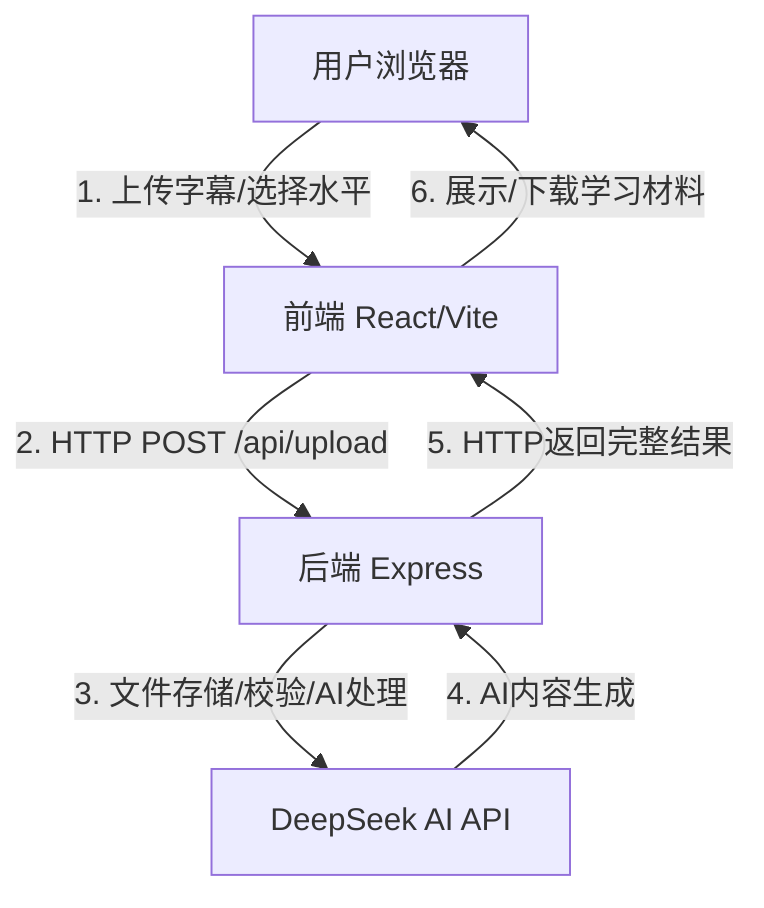

# 智能语言学习助手 - 项目架构与文件说明

---

## 1. 项目定位与技术栈

- **定位**：通过上传英语字幕（TXT/SRT），利用AI（DeepSeek API）自动生成个性化学习材料，支持多种英语水平，前后端分离，采用HTTP通信提高稳定性。
- **前端**：React 19.1.0 + Vite 7.0.4 + Ant Design 5.26.5 + Axios 1.10.0
- **后端**：Node.js 18+ + Express 4.18.2 + Multer 1.4.5 + DeepSeek API
- **部署**：支持本地、CloudBase、Docker等

---

## 2. 架构图（文字版）

> // 以上为系统主要数据流，采用HTTP通信提高稳定性

---

## 3. 数据流程图（简化）

1. **上传文件**  
2. **后端校验/分句/分段**  
3. **AI批量处理（带重试机制）**  
4. **HTTP返回完整结果**  
5. **前端展示/下载**

---

## 4. 主要功能模块说明

### 4.1 前端（frontend/）

- `src/App.jsx`：主界面，负责文件上传、进度展示、结果交互、下载等。 // 主入口
- `src/services/websocket.js`：WebSocket连接管理（已弃用，改为HTTP通信）。 // 实时通信（已停用）
- `src/config/api.js`：API与WebSocket地址、环境配置。 // 配置管理
- `src/utils/`：工具与测试代码。 // 辅助功能
- `App.css/index.css`：样式文件。 // 界面美化
- `vite.config.js`、`eslint.config.js`：构建与代码规范配置。 // 开发辅助
- `verify-production-urls.js`：生产环境URL验证脚本（辅助工具）。
- `ERROR_HANDLING_FEATURES.md`：前端错误处理机制文档。

### 4.2 后端（backend/）

- `src/index.js`：后端启动入口。 // 启动服务
- `src/app.js`：Express应用配置，整合中间件、路由、错误处理。 // 应用主配置
- `src/config/index.js`：全局配置（端口、AI参数、CORS、上传限制等）。 // 配置管理
- `src/routes/uploadRoutes.js`：API路由定义（上传、健康检查、网络诊断等）。 // 路由
- `src/controllers/uploadController.js`：上传与处理主控制器。 // 业务控制
- `src/services/aiService.js`：AI调用与智能内容生成（分句、分段、解释、词汇分析）。 // AI核心
- `src/services/fileProcessingService.js`：文件解析、AI分句、分段、词汇分析等。 // 文件处理
- `src/services/websocketService.js`：WebSocket服务端（已弃用，改为HTTP通信）。 // 实时推送（已停用）
- `src/middleware/upload.js`：Multer上传中间件，文件校验。 // 上传校验
- `src/utils/logger.js`：日志工具。 // 日志
- `src/utils/networkDiagnostic.js`：网络诊断工具。 // 网络诊断
- `test_large_file_optimization.js`、`test_srt_paragraph_generation.js`：后端测试脚本。 // 测试
- `LARGE_FILE_OPTIMIZATION.md`：大文件处理优化方案文档。 // 文档

---

## 5. 文件作用一览表

| 文件/目录 | 作用 | 是否影响系统功能 |
|---|---|---|
| frontend/src/App.jsx | 前端主界面 | 是 |
| frontend/src/services/websocket.js | WebSocket管理（已弃用） | 否（已停用） |
| frontend/src/config/api.js | API配置 | 是 |
| frontend/App.css, index.css | 样式 | 否（仅影响外观）|
| frontend/ERROR_HANDLING_FEATURES.md | 错误处理文档 | 否（文档）|
| frontend/README.md | 前端说明 | 否（文档）|
| backend/src/index.js | 后端入口 | 是 |
| backend/src/app.js | Express配置 | 是 |
| backend/src/config/index.js | 配置 | 是 |
| backend/src/routes/uploadRoutes.js | API路由 | 是 |
| backend/src/controllers/uploadController.js | 控制器 | 是 |
| backend/src/services/aiService.js | AI服务 | 是 |
| backend/src/services/fileProcessingService.js | 文件处理 | 是 |
| backend/src/services/websocketService.js | WebSocket服务（已弃用） | 否（已停用） |
| backend/src/middleware/upload.js | 上传中间件 | 是 |
| backend/test_large_file_optimization.js | 测试脚本 | 否（测试）|
| backend/test_srt_paragraph_generation.js | 测试脚本 | 否（测试）|
| backend/LARGE_FILE_OPTIMIZATION.md | 优化文档 | 否（文档）|
| backend/README.md | 后端说明 | 否（文档）|
| CloudBase部署方案.md | 云部署文档 | 否（文档）|
| 项目架构分析报告.md | 架构分析文档 | 否（文档）|
| package.json, package-lock.json | 依赖管理 | 是 |
| .gitignore | Git忽略 | 否 |

---

## 6. 不影响系统功能的文件（建议可删/可忽略）

- 所有 `.md` 文档（如 `README.md`, `LARGE_FILE_OPTIMIZATION.md`, `ERROR_HANDLING_FEATURES.md`, `CloudBase部署方案.md`, `项目架构分析报告.md`）
- 前端/后端的 `test_*.js` 测试脚本
- `frontend/src/utils/` 下的测试文件
- `frontend/verify-production-urls.js`
- 样式文件（仅影响界面美观，不影响功能）
- `.gitignore`、`eslint.config.js`、`vite.config.js`（仅影响开发体验）

---

## 7. 主要挑战与限制

- **AI接口依赖**：DeepSeek API 的可用性和速率限制直接影响体验，已添加重试机制和网络诊断。
- **大文件处理**：已做分块、动态超时、智能重试优化，但极大文件仍有失败风险。
- **HTTP通信优化**：去除WebSocket避免兼容性问题，采用HTTP通信提高部署稳定性。

---

## 8. 备注与建议

- 架构图/数据流图可用 draw.io、ProcessOn、XMind 等工具绘制，或用 Mermaid 语法补充。
- 如需详细的“类图/时序图/流程图”，可补充说明。
- 如需对某一模块做更深入的代码注释或讲解，请随时告知。
- **更新说明**: 项目已去除WebSocket通信，改为纯 HTTP 通信，提高了部署稳定性和兼容性。

---

> 本文档由AI助手自动生成并更新，适合新手开发者快速理解项目结构与文件作用。最新更新：去除WebSocket，采用HTTP通信。 